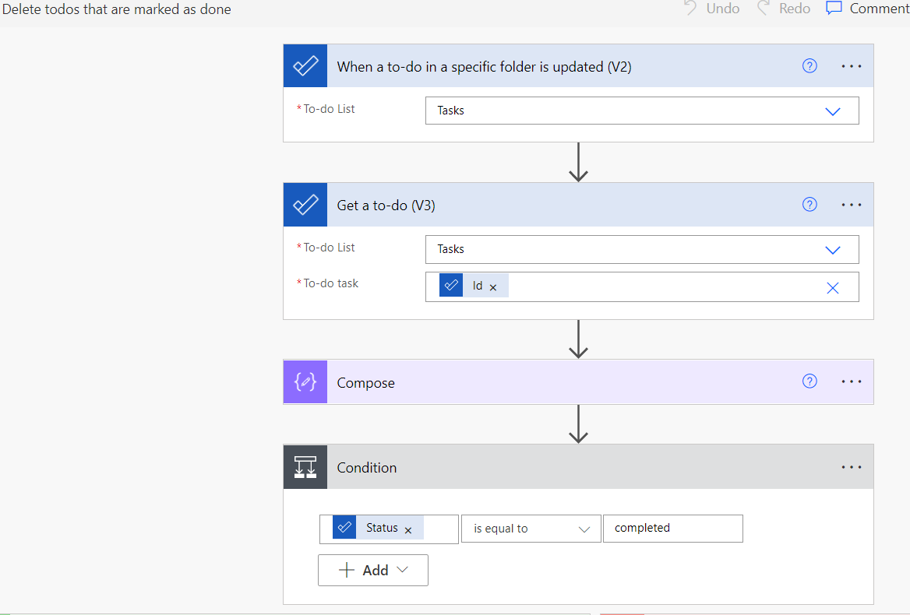

## Clean out tasks marked done

Power Automate is just great for cleaning things - be it lists, mailboxes or, like in this case, tasks.

In a last step, the task is dumped for good.

Want to learn more? Check out my many other articles:

[Advanced Automation using Azure & serverless services](https://medium.com/serverless-and-lowocode-pioneers/using-logic-apps-to-orchestrate-a-complex-video-processing-process-flow-a0ef20237511)

And even more:

**LinkedIn** > [LinkedIn Articles about Business & Tech](https://www.linkedin.com/today/author/mbrueckner)

**Medium** > [Articles about detailed topics around Cloud Computing and more](https://medium.com/@mohammedbrueckner)

**DevTo** > [Even more detailed articles on topics like using AI Services](https://dev.to/mrbrue)

Cheers!
[Mo](https://github.com/MoBRUEC)
