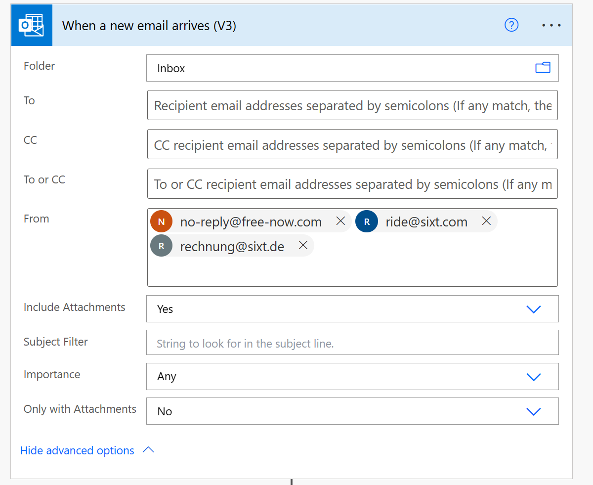
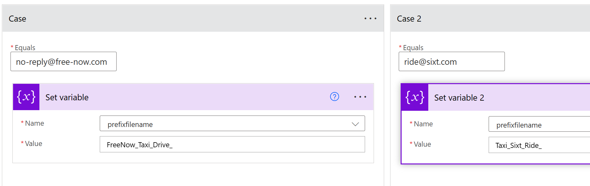
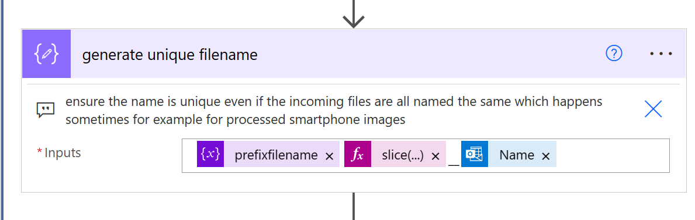
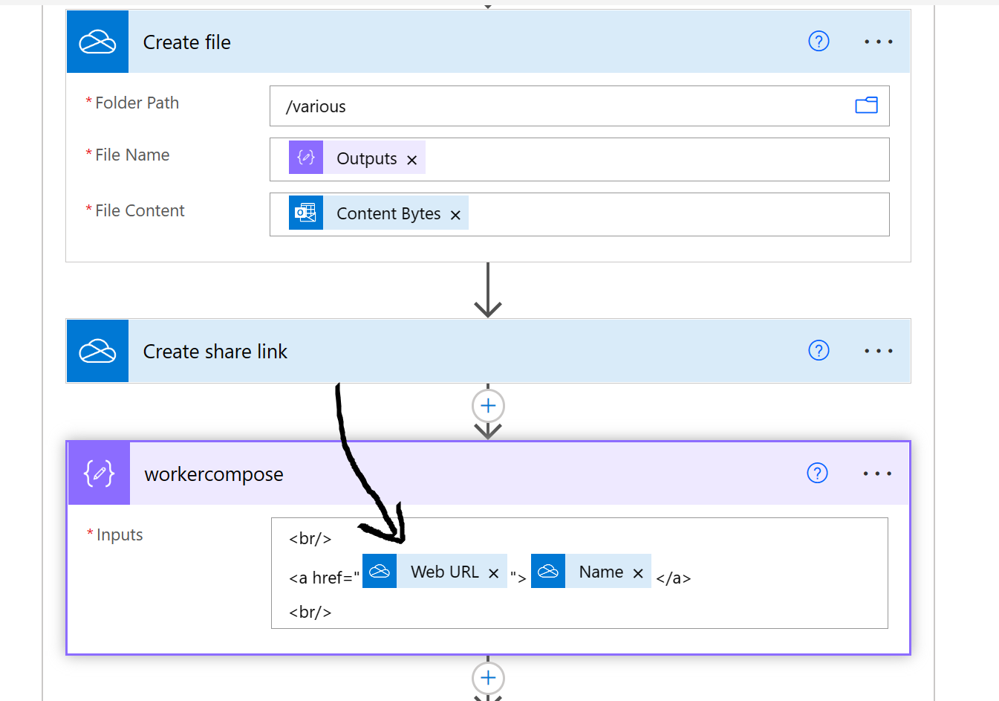
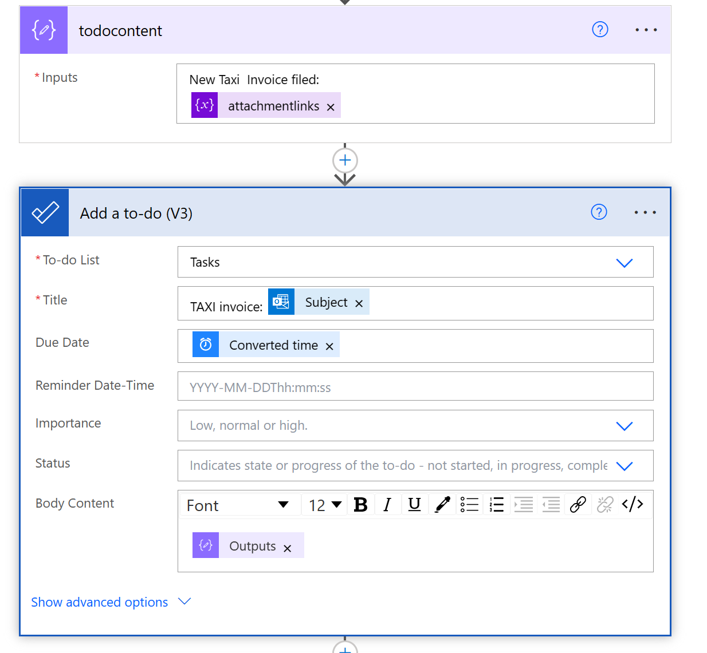

## Clean out tasks marked done

Power Automate is just great for managing inbound messages and events - be it lists or, like in this case, mails.


In my case I am checking for taxi receipts coming in via e-mail attachments. Make sure "Include attachments" is turned on.

Beyond some boiler plate details like initiating variables I am checking here for the type of ride service and do add some prefix/suffix based on that, together with the time of the day (using Convert To TimeZone).


What you basically want to make sure is that you end up with a unique file name for your attachment because sooner or later those files could end up in the same directory somehwere. (In my case I am stashing them all into the same OneDrive folder, in fact. Good practice? Well I am not talking about hundres of thousands of files there so I am not worried.)


For generating unique file names you can always take advantage of the unique attachment IDs for example, like I do in this example:
```slice(outputs('Get_Attachment_(V2)')?['body/id'], -6)```

What I would like to do is create an attachment in my personal OneDrive and a new Todo together with it.
Why? Simply that will make using it later on for uploading a receipt to the Expense management system so much easier - just follow the link to the file, upload it, done. (Yes, this part would call for automation as well but that would get a lot more complex and eventually would come down to having a very good understanding of the Finance Management solution used including APIs.)

And some tweaking and creating the Todo:


And that's it. Now I can safely delete the mail, the attachment is stored and linked to. I could in addition [create a OneNote entry, if I wanted](/turn%20newsletters%20in%20onenote%20entries.md).