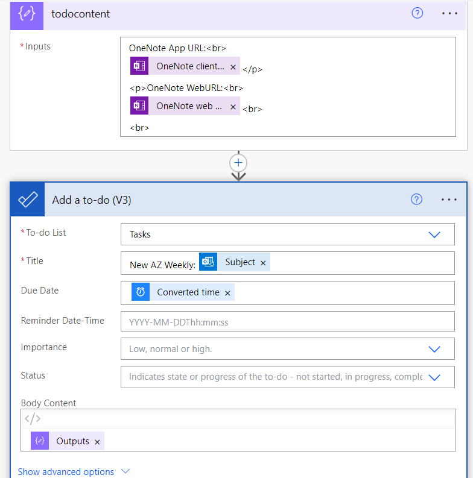

## Turn newsletters into OneNote entries 

Want to save newsletters or any other precious mails you receive to OneNote, where they're indexed?
Easy job with Power Automate:


The compose step "peeked code" looks like this:

``` 
"inputs": "<html>\n<head>\n<title>@{triggerOutputs()?['body/subject']}</title>\n<meta name=\"created\" content=\"@{triggerOutputs()?['body/receivedDateTime']}\" />\n</head>\n<body data-absolute-enabled=\"true\" style=\"font-size:20px\">\n<br/>@{body('Convert_time_zone')}<br/>\n<br/>@{triggerOutputs()?['body/body']}<br/>\n</body>\n</html>"
```


Adding a todo on top linking to the new OneNote entries ("web" and "client" links) is easy enough:


The "Web client link" is the link to the web representation of your OneNote content. The client link will open up in your desktop application of OneNote.
And don't forget to clean up when everything is done and dusted ;):


Want to learn more? Check out my many other articles:

[Advanced Automation using Azure & serverless services](https://medium.com/serverless-and-lowocode-pioneers/using-logic-apps-to-orchestrate-a-complex-video-processing-process-flow-a0ef20237511)

And even more:

**LinkedIn** > [LinkedIn Articles about Business & Tech](https://www.linkedin.com/today/author/mbrueckner)

**Medium** > [Articles about detailed topics around Cloud Computing and more](https://medium.com/@mohammedbrueckner)

**DevTo** > [Even more detailed articles on topics like using AI Services](https://dev.to/mrbrue)

Cheers!
[Mo](https://github.com/MoBRUEC)
